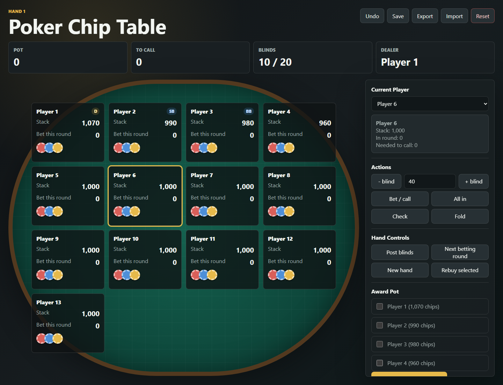

# Offline Poker Chip Table

A browser-based poker chip tracker for playing real-card poker when physical chips are not available.

The app was built for hostel poker nights where players still want a simple way to track stacks, blinds, bets, folds, pots, and winners without carrying a chip set.

## Features

- Set up 2 to 13 players
- Configure starting chips, small blind, and big blind
- Track player stacks, current bets, folded players, and all-in players
- Post blinds and move between betting rounds
- Award the pot to one or multiple winners
- Rebuy a selected player
- Undo recent actions
- Save the table in the browser
- Export and import table backups as JSON

## Run Locally

No build step is required.

1. Clone the repository.
2. Open `index.html` in a browser.
3. Start a table and enter player names.

## Tech Stack

- HTML
- CSS
- JavaScript
- Browser `localStorage`

## Use Case

This is useful for casual offline poker games where the cards are physical but chip accounting needs to be digital.
